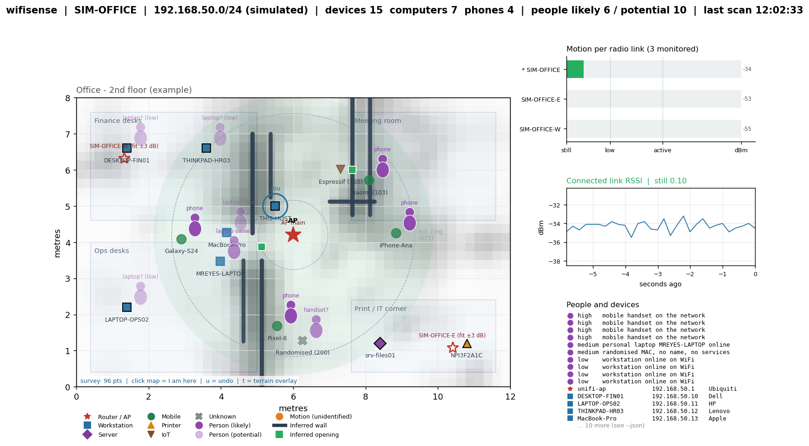

# wifisense

Small Python application that discovers **workstations, servers, phones and other devices** on the WiFi network you are connected to, estimates **potential people** from device evidence and multi-radio motion sensing, infers **walls and openings** from a walk-around survey, and draws everything on a **live visual map**.

## Requirements

| Item | Value |
|---|---|
| Python | >= 3.10 (tested on 3.14) |
| Python packages | `matplotlib>=3.7` (brings numpy); `pytest` for tests |
| OS tools (Windows) | `ping`, `arp`, `ipconfig`, `netsh wlan`, native `wlanapi.dll` (all built in) |
| OS tools (Linux) | `ping`, `ip`, `iw`, `nmcli`, `/proc/net/wireless` |
| Privileges | None. No raw sockets, no Npcap/libpcap, no monitor mode. |
| Network | Client must be joined to the WiFi network being mapped. |

```bash
pip install -r requirements.txt
```

## Run

| Command | What it does |
|---|---|
| `python -m wifisense --simulate --simulate-survey --floorplan floorplan.example.json` | Full demo: simulated office, walking person, auto-generated survey, terrain overlay. No network access. |
| `python -m wifisense` | Live map of the local /24: device sweep every 60 s, connected-link sample every 1 s, all radios every 5 s. |
| `python -m wifisense --room 8x6 --survey myroom.survey.json` | Survey mode with no floor-plan file. Click the map where you are standing to record a point; walls appear as points accumulate. |
| `python -m wifisense --survey office.survey.json --floorplan office.json` | Survey mode with a floor plan (zones, pinned APs, known desks). |
| `python -m wifisense --once --no-ports --snapshot map.png --json state.json` | Headless single pass; writes an image and JSON. |
| `python -m wifisense --no-ports --no-dns --no-links` | Quietest mode: ping/ARP only, no radio scans. |

Live-window keys: **left-click on the map** = "I am here" (records a survey point when `--survey` is on), **u** = undo last point, **t** = toggle terrain overlay. Run `python -m wifisense --help` for all options.



## What the map shows

| Element | Source | Confidence |
|---|---|---|
| Router / access points (red stars) | Default gateway; `access_points` in the floor plan; hollow stars are positions fitted from the survey | High / high / see residual |
| Workstations / servers | RDP, SMB, RPC, SSH ports; hostname patterns; NIC vendor | High when ports respond |
| Mobile devices (green) | iOS sync port 62078, hostname, handset vendor OUI | Medium |
| **Person, likely** (solid purple) | A phone; a randomised-MAC host with no name or services; a laptop named after a person | High / medium |
| **Person, potential** (faded purple) | Any other workstation online on WiFi | Low |
| **Motion, unidentified** (orange, dashed ring) | RSSI variance rose on one or more host-to-AP links; placed at the score-weighted midpoint of the perturbed links, which are drawn in orange | Medium, high if 2+ links agree |
| Device position, black-edged marker | `known_devices` in the floor plan | Exact (you supplied it) |
| Device position, plain marker on dashed ring | Ring radius from ICMP RTT, angle from a MAC hash | Schematic only |
| Grey shading | Obstruction score: how sharply excess path loss rises moving away from each AP | 0..1 |
| Dark lines | Inferred wall segments (thicker = higher score) | Hypothesis |
| Green squares | Inferred openings: short gaps in a wall line | Hypothesis |

Title bar: `people likely N / potential M`. Likely = high + medium candidates; potential = all candidates.

## Surveying a room for terrain

No floor-plan file is required. `--room 8x6` sets the area size in metres; access-point positions are fitted from the survey and your position comes from your clicks. A floor-plan file only adds optional extras: zones to draw, known AP positions (BSSID from `netsh wlan show interfaces`) to pin instead of fit, and fixed device positions.

1. Measure the room roughly and start with `--room WxH --survey myroom.survey.json` (or pass a floor-plan file instead of `--room`).
2. Origin is the bottom-left corner of the map; keep that corner in mind while you walk.
3. Walk a grid about 1 m apart, covering both sides of every wall. At each stop, click that spot on the map. Each click takes two forced radio scans (about 5 s on Windows) and averages them.
4. Walls appear after a few points; openings need points on both sides of a doorway. More radios in range (neighbours' APs count) give more viewing angles and better walls.

The state JSON carries `terrain.walls`, `terrain.openings` and fitted `terrain.access_points` with residual dB, so you can judge each fit.

### How terrain inference works

Each radio's RSSI across the survey is fitted to a log-distance path-loss model (position grid-searched when unknown, iteratively reweighted so points behind walls do not bias it). The gap between model and measurement is the *excess loss*; a wall between the AP and a point adds a step of several dB to it. The excess field is interpolated onto a 0.25 m grid and its **outward radial gradient** is taken: walls produce a loss step as you move away from the AP across them, whereas shadow edges fanning through a doorway change the field sideways and are rejected. Layers from all radios are averaged (weighted by fit quality, suppressed within 1 m of each AP), ridge cells forming straight runs become wall segments, and short gaps between collinear runs become openings.

## Floor plan file

Copy `floorplan.example.json`. Units are metres, origin bottom-left. `known_devices` keys may be a MAC, an IP or a hostname. `access_points` keys are BSSIDs. `host` is where the laptop normally sits; survey clicks override it.

```json
{
  "name": "Office", "width_m": 12, "height_m": 8,
  "access_point": {"x": 6, "y": 4},
  "host": {"x": 5.5, "y": 5},
  "access_points": {"24:a4:3c:11:22:33": {"x": 6, "y": 4.2, "label": "AP main"}},
  "zones": [{"name": "Desks", "x": 0.4, "y": 0.4, "w": 5, "h": 3}],
  "known_devices": {"f8:b1:56:aa:01:01": {"label": "FIN-01", "x": 1.4, "y": 6.6}}
}
```

## Architecture

```
wifisense/
  netinfo.py   local IP / subnet / gateway; connected-link RSSI (netsh / /proc/net/wireless)
  wlan.py      every radio in range with dBm: Windows native WLAN API (ctypes), netsh fallback, nmcli on Linux
  scanner.py   ICMP sweep -> ARP table -> reverse DNS -> TCP fingerprint -> classify()
  oui.py       built-in OUI vendor table + IEEE file loader
  presence.py  RSSI-variance motion detector (adaptive noise floor, 0..1 score)
  links.py     one detector per radio link -> per-direction motion
  people.py    evidence ladder -> PersonCandidate list (devices + localised motion)
  survey.py    survey points (position + per-radio dBm), JSON persistence
  terrain.py   AP localisation, excess-loss grid, radial gradient, walls, openings
  mapping.py   floor-plan model; floorplan / anchor / estimate placement
  engine.py    background scan, sample, link and terrain threads; thread-safe SensingState
  render.py    matplotlib live window (click / u / t) and PNG/SVG/PDF snapshot
  simulate.py  synthetic office with walls, three APs and a walking person
  cli.py       argument parsing, validation, wiring
```

Tests: `python -m pytest` (51 tests, including terrain recovery against the simulated ground truth).

## Limits (read before relying on the output)

- **This is not CSI radar.** Consumer NICs on Windows do not expose Channel State Information. Motion sensing uses RSSI variance on each host-to-AP link, so it says *which links* a moving body crossed, not where a person stands. The orange marker is the midpoint of the perturbed links, an approximation that improves with more radios and known AP positions.
- **People are inferred, not detected.** Phones and personal laptops are proxies; guests without a joined device are invisible except through motion. Confidence is shown on every candidate.
- **Terrain is a hypothesis.** Resolution is bounded by survey spacing and RSSI noise (2 to 3 dB on real hardware, which is why each click averages two scans). Expect partial walls and occasional false segments, and openings only where you surveyed both sides. Thin partitions (< 3 dB) will not register.
- **Estimated device positions are schematic.** RTT is a link-quality proxy, not distance.
- **Client isolation** on guest networks blocks ICMP/TCP between clients; only the gateway and your own host will appear.

## Impact & Risk Analysis

| Area | Note |
|---|---|
| Authorisation | ICMP sweeps and TCP fingerprinting are active scans. Run only on networks you administer or have written permission to test. [ISO 27001 A.8.8 / CIS Control 12] |
| Radio scans | `WlanScan` every 5 s is the same operation Windows performs itself; it briefly interrupts throughput on the adapter. Raise `--link-interval` or use `--no-links` if that matters. |
| Network load | Default sweep: 254 ICMP echoes + up to 13 TCP SYNs per live host, once per minute. Use `--no-ports --scan-interval 300` to reduce. |
| Privacy | Output contains MACs, hostnames, inferred presence and a map of a physical space. Treat `state.json`, survey files and snapshots as personal data; do not retain longer than needed. |
| Availability | No writes to any device; failures degrade to "unknown" classes and an "unavailable" motion state. |
